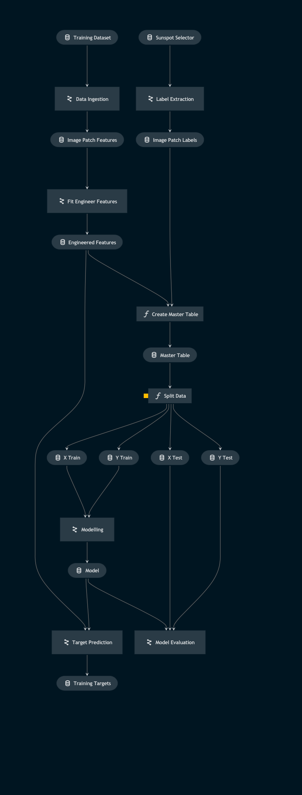

# Sunspots
## Overview
The Solar Dynamics Observatory (SDO) is equipped with the Helioseismic and Magnetic Imager (HMI) instrument, which measures the intensity of the Sun in the region of the Fe I spectral line at 6173Å on the solar surface. More information [here](http://jsoc.stanford.edu/HMI/Continuum.html).

The resultant "intensitygrams" give a clear picture of the solar surface, from which the origin and evolution of sunspots and their links with solar magnetic activity can be investigated.

<!-- Sunspots are impermanent artefacts on the solar surface caused by plasma rotating faster at the solar equator than at the poles. The charged plasma produces a magnetic field which becomes entangled due this differential rotation. If the forces acting on the magnetic flux tubes in the plasma become great enough, they can arc through the solar surface and inhibit the convective process that transfers energy from the solar interior to the photosphere, thereby cooling the local region - making it appear visually darker. -->

A timeseries of white-light continuum data is useful for the investigation of phenomena such as umbral decay rate, the Wilson effect, sunspot velocity during flare activity, and other areas of inquiry.

While algorithms such as the Sunspot Tracking And Recognition Algorithm (STARA) already exist to perform image segmentation analyses of sunspots, this algorithm is computationally expensive to run on native resolution HMI continuum images (4096px $\times$ 4096px), as STARA’s resource requirements increase exponentially with resolution.

To solve this problem, one can train a machine learning classifer to detect regions of the solar surface with active sunspot/pore activity; in this case: a support vector machine. Subsequently, a segmentation analysis can be performed using STARA only on these smaller active regions. Using this strategy drastically reduces execution time for full resolution images.

Such is the purpose of this project - to provide an efficient way of building a sunspot catalog from intesitygram timeseries for use in scientific studies.

## Components
### Datasets
#### `SunPyMapDataSet` 
Kedro Custom dataset which reads/writes SunPy Map objects to/from a specified cloud service such as Amazon S3, or locally.

### Utilities
#### `SunspotSelector`
A class to assign labels to regions of training images which contain sunspot/pore activity.
Designed to be used with the `matplotlib` widget backend inside a Jupyter notebook.

#### `SunspotInspector`
A class designed to overplot target predictions on their corresponding Map as a visual verifiction that the model is functioning correctly.
Designed to be used with the `matplotlib` widget backend inside a Jupyter notebook.

<!-- 
The HMI continuum data used to for this project can be obtained through the SunPy API.
-->

<!-- Data obtained from SunPy API
-->
### Pipelines
#### Training Pipeline

The training pipeline trains a support vector machine capable of assigning targets to SunPy Map patches based on their sunspot/pore activity.

Before training can be performed, one needs a training dataset (which can be obtained via the SunPy API). This dataset can then be used with the `SunspotSelector` class while using the `matplotlib` widget backend inside a Jupyter notebook to assign labels to regions of solar activity.



Run training pipeline with:
```
kedro run --pipeline training_pipeline
```

#### Execution Pipeline

The execution pipeline uses the trained SVM to classify SunPy Map patches based on their sunspot/pore contents.

Contigous regions of activity are then extracted and saved as sub-Maps, before being analysed by the STARA algorithm.


Run an execution pipeline using the date determined by the SunPy API when your dataset downloads. For example, for `20140910Timeseries`:
```
kedro run --pipeline 20140910_execution
```

## Install dependencies

```
pip install -r src/requirements.txt
```

Optionally install the project in editable mode:
```
pip install -e src
```

## Credits
Chris Osborne
[@goobley](https://www.github.com/goobley) 
* A revision of the STARA algorithm supporting JIT compilation: https://github.com/Goobley/stara
* Basis code for the utilities: `SunspotSelector`, `SunspotInspector`  
* Region extraction functions: `select_region`, `extract_region`  
* Plotting functions: `overplot_rect_from_coords`, `overplot_spots_from_mask`

Fraser Watson
[@fraserwatson](https://github.com/fraserwatson)  
* The original STARA algorithm: https://github.com/fraserwatson/stara
    * [STARA journal article](https://www.cambridge.org/core/journals/proceedings-of-the-international-astronomical-union/article/automated-sunspot-detection-and-the-evolution-of-sunspot-magnetic-fields-during-solar-cycle-23/297F5626367A5EC3C52F57160DB4178A)

## Kedro
The template for this project was generated using `Kedro 0.18.3`: 
[Kedro documentation](https://kedro.readthedocs.io)