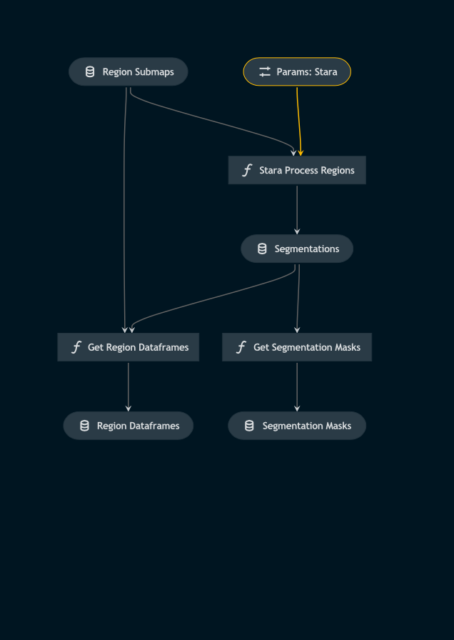

# Pipeline STARA

> *Note:* This is a `README.md` boilerplate generated using `Kedro 0.18.3`.

## Overview

<!---
Please describe your modular pipeline here.
-->

This pipeline:
1. Implements the STARA algorithm to aquire map segmentations
2. Builds a dataframe containing the properties of the features from each segmentation

## Pipeline inputs

<!---
The list of pipeline inputs.
-->

### `region_submaps`
|      |                    |
| ---- | ------------------ |
| Type | `dict[str, Callable[[] \| sunpy.map.Map]]` |
| Description | Kedro `PartitionedDataSet` - dictionary of callables for Map objects. Sub-Maps containing only the regions of solar activity from each frame of the timeseries. |

## Pipeline outputs

<!---
The list of pipeline outputs.
-->

### `segmentation_masks`
|      |                    |
| ---- | ------------------ |
| Type | `dict[str, Callable[[] \| np.ndarray]]` |
| Description | Kedro `PartitionedDataSet` - dictionary of callables for integer NumPy arrays. Each unique feature from a segmentation has a unique label in the corresponding segmentation_mask array. Useful for lifetime tracking with additional algorithms. |

### `region_dataframes`
|      |                    |
| ---- | ------------------ |
| Type | `dict[str, Callable[[] \| pd.DataFrame]]` |
| Description | Kedro `PartitionedDataSet` - dictionary of callables for Pandas DataFrames. Each dataframe contains the properties of its corresponding region_submap, such as the centroid, area etc. of each segmented feature of the submap. |
