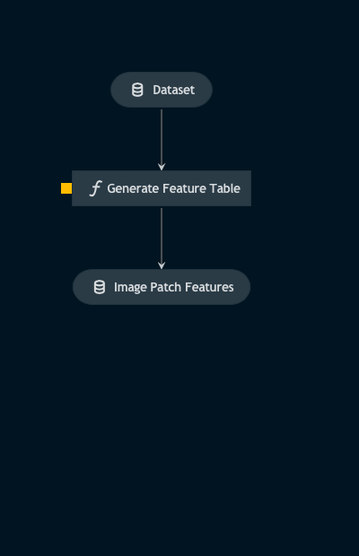

# Pipeline data_ingestion

> *Note:* This is a `README.md` boilerplate generated using `Kedro 0.18.3`.

## Overview

<!---
Please describe your modular pipeline here.
-->

This pipeline:
1. ingests a timeseries of .fits files as SunPy Maps
2. slices them into patches and computes the properties of each patch
3. returns this information in a dataframe  

## Pipeline inputs

<!-- -
The list of pipeline inputs. -->

### `dataset`
|      |                    |
| ---- | ------------------ |
| Type | `dict[str, Callable[[] \| sunpy.map.Map]]` |
| Description | Kedro `PartitionedDataSet` - dictionary of callables for Map objects. Timeseries of `.fits` files aquired from the SunPy API. |

## Pipeline outputs

<!-- -
The list of pipeline outputs.
 -->

### `image_patch_features`
|      |                    |
| ---- | ------------------ |
| Type | `pd.DataFrame` |
| Description | Dataframe of features computed from the patches of all images in the dataset. |
