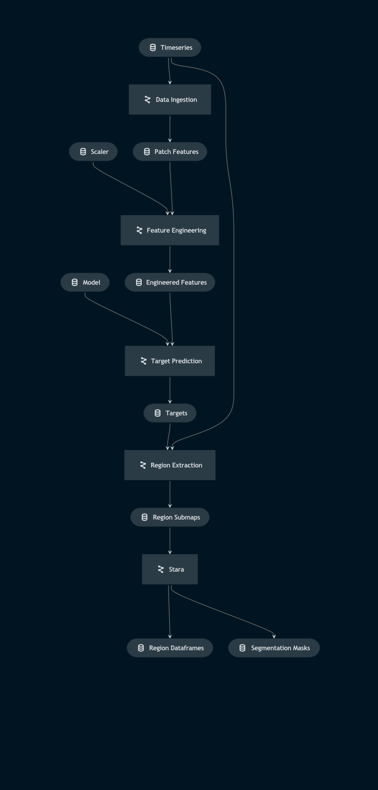

# Pipeline execution_pipeline

> *Note:* This is a `README.md` boilerplate generated using `Kedro 0.18.3`.

## Overview

This pipeline:
1. Ingests a timeseries of `.fits` files acquired from the SunPy API
2. Creates a feature set from timeseries image patches, transforms the features with the training scaler
3. Uses the trained model to predict targets for each of the image patches
4. Extracts from the parent maps, sub-maps of contiguous patches that contain solar activity 
5. Processes those submaps using the STARA algorithm to build a sunspot catalog and obtain a segmentation of each active region

<!---
Please describe your modular pipeline here.
-->

## Pipeline inputs

<!---
The list of pipeline inputs.
-->

### `Timeseries`
|      |                    |
| ---- | ------------------ |
| Type | `dict[str, Callable[[] \| sunpy.map.Map]]` |
| Description | Kedro `PartitionedDataSet` - dictionary of callables for Map objects. Timeseries of `.fits` files aquired from the SunPy API. |

## Pipeline outputs

<!---
The list of pipeline outputs.
-->

### `region_dataframes`
|      |                    |
| ---- | ------------------ |
| Type | `dict[str, Callable[[] \| pd.DataFrame]]` |
| Description | Kedro `PartitionedDataSet` - dictionary of callables for Pandas DataFrames. Each dataframe contains the properties of its corresponding region_submap, such as the centroid, area etc. of each segmented feature of the submap. |

### `segmentation_masks`
|      |                    |
| ---- | ------------------ |
| Type | `dict[str, Callable[[] \| np.ndarray]]` |
| Description | Kedro `PartitionedDataSet` - dictionary of callables for integer NumPy arrays. Each unique feature from a segmentation has a unique label in the corresponding segmentation_mask array. Useful for lifetime tracking with additional algorithms. |
