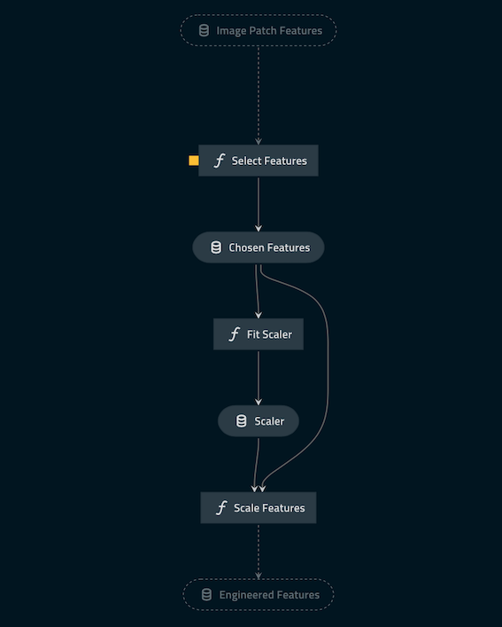
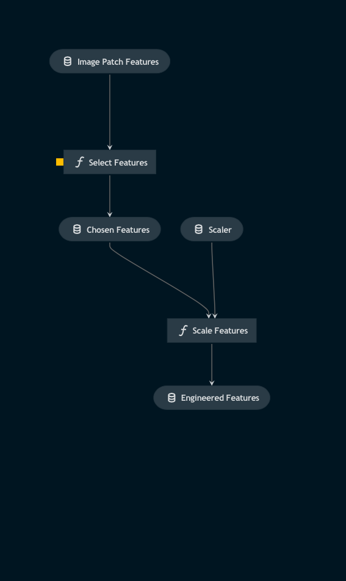

# Pipeline feature_engineering

> *Note:* This is a `README.md` boilerplate generated using `Kedro 0.18.3`.

## Overview

<!---
Please describe your modular pipeline here.
-->

This pipeline contains two pipes:
1. One that both fits a scaler to the training features and transforms them.

2. One which uses the scaler fitted to the training features to transform features of datasets unseen by the model.

## Pipeline inputs

<!---
The list of pipeline inputs.
-->

### `image_patch_features`
|      |                    |
| ---- | ------------------ |
| Type | `pd.DataFrame` |
| Description | Dataframe of features computed from the patches of all images in the dataset |

## Pipeline outputs

<!---
The list of pipeline outputs.
-->

### `engineered_features`
|      |                    |
| ---- | ------------------ |
| Type | `pd.DataFrame` |
| Description | Dataframe of patch features which have been transformed by the scaler |
