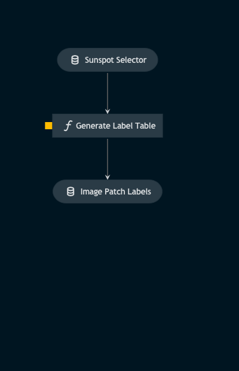

# Pipeline label_extraction

> *Note:* This is a `README.md` boilerplate generated using `Kedro 0.18.3`.

## Overview

This pipeline:
1. extracts labels from the interactive widget used to assign them
2. returns a dataframe of label information for all images in a dataset

<!---
Please describe your modular pipeline here.
-->

## Pipeline inputs

<!---
The list of pipeline inputs.
-->

### `sunspot_selector`
|      |                    |
| ---- | ------------------ |
| Type | `sunspots.extras.utils.sunspot_selector.SunspotSelector` |
| Description | SunspotSelector class object used in a Jupyter notebook to interactively label patches containing sunspot/pore activity. The class stores the HMI and patch coordinates of these active regions. |

## Pipeline outputs

<!---
The list of pipeline outputs.
-->

### `image_patch_labels`
|      |                    |
| ---- | ------------------ |
| Type | `pd.DataFrame` |
| Description | Pandas DataFrame of patches information. Contains the key for the parent image, the coordinates of the patch, and a binary label for the patch based on whether it contains active solar regions. |