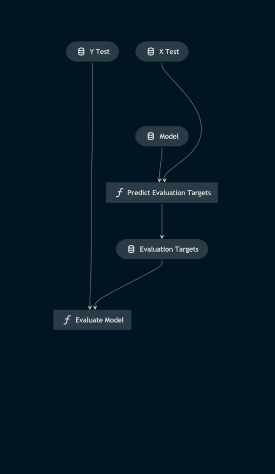

# Pipeline model_evaluation

> *Note:* This is a `README.md` boilerplate generated using `Kedro 0.18.3`.

## Overview

<!---
Please describe your modular pipeline here.
-->

This pipeline:
1. Predicts the contents of image patches from their feature sets using the trained SVM model
2. Evaluates the performance of the model via precision, accuracy and confusion matrix metrics

## Pipeline inputs

<!---
The list of pipeline inputs.
-->

### `x_test`
|      |                    |
| ---- | ------------------ |
| Type | `pd.DataFrame` |
| Description | The portion of the training features allocated to testing the model. A dataframe of engineered features derived from training image patches. |

### `y_test`
|      |                    |
| ---- | ------------------ |
| Type | `pd.Series` |
| Description | The portion of the training labels allocated to testing the model. A dataframe of labels corresponding to each feature set / image patch. |

### `model`
|      |                    |
| ---- | ------------------ |
| Type | `sklearn.svm._classes.SVC` |
| Description | The trained support vector machine |

## Pipeline outputs

<!---
The list of pipeline outputs.
-->

### N/A

There are no outputs, but the precision, accuracy and confusion matrix results are logged to the console.