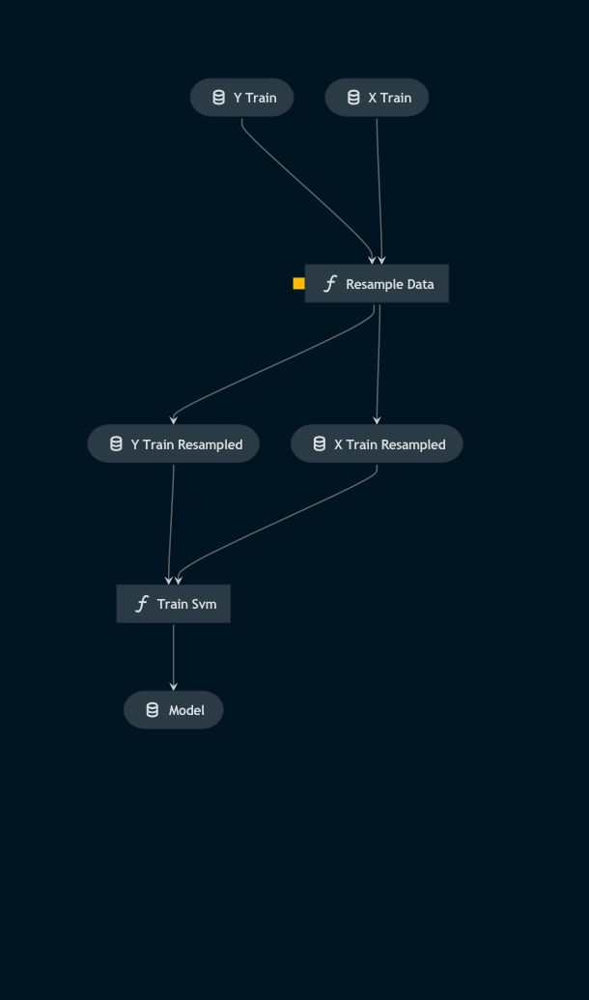

# Pipeline modelling

> *Note:* This is a `README.md` boilerplate generated using `Kedro 0.18.3`.

## Overview

<!---
Please describe your modular pipeline here.
-->

This pipeline:

1. Resamples the input features and labels according to specified parameters to improve model performance
2. Trains the support vector machine (with a radial basis function kernel) using the resampled features and labels

## Pipeline inputs

<!---
The list of pipeline inputs.
-->

### `x_train`
|      |                    |
| ---- | ------------------ |
| Type | `pd.DataFrame` |
| Description | The portion of the training features allocated to training the model. A dataframe of engineered features derived from training image patches. |

### `y_train`
|      |                    |
| ---- | ------------------ |
| Type | `pd.Series` |
| Description | The portion of the training labels allocated to training the model. A dataframe of labels corresponding to each feature set / image patch. |

## Pipeline outputs

<!---
The list of pipeline outputs.
-->

### `model`
|      |                    |
| ---- | ------------------ |
| Type | `sklearn.svm._classes.SVC` |
| Description | The trained support vector machine |