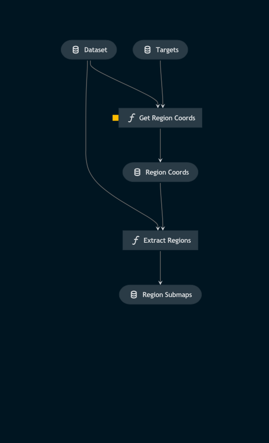

# Pipeline region_extraction

> *Note:* This is a `README.md` boilerplate generated using `Kedro 0.18.3`.

## Overview

<!---
Please describe your modular pipeline here.
-->

This pipeline:
1. Acquires the coordinates of the regions in each Map containing solar activity
2. Uses those coordinates to extract the regions as submaps.

## Pipeline inputs

<!---
The list of pipeline inputs.
-->

### `dataset`
|      |                    |
| ---- | ------------------ |
| Type | `dict[str, Callable[[] \| sunpy.map.Map]]` |
| Description | Kedro `PartitionedDataSet` - dictionary of callables for Map objects. Timeseries of `.fits` files aquired from the SunPy API. |

### `targets`
|      |                    |
| ---- | ------------------ |
| Type | `np.ndarray` |
| Description | The model predictions for whether patches contain regions of solar activity or not, for all patches across all images of the dataset. |

## Pipeline outputs

<!---
The list of pipeline outputs.
-->

### `region_submaps`
|      |                    |
| ---- | ------------------ |
| Type | `dict[str, Callable[[] \| sunpy.map.Map]]` |
| Description | Kedro `PartitionedDataSet` - dictionary of callables for Map objects. Sub-Maps containing only the regions of solar activity from each frame of the timeseries. |