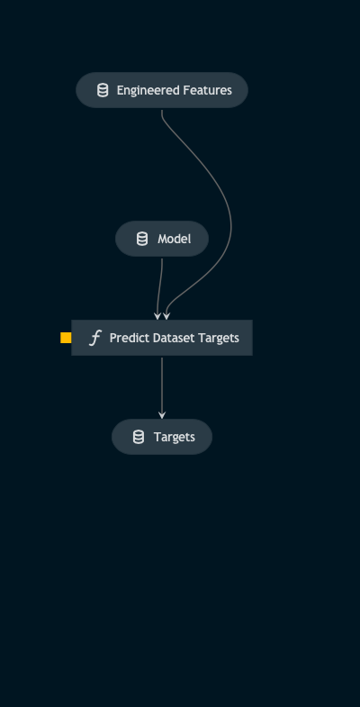

# Pipeline target_prediction

> *Note:* This is a `README.md` boilerplate generated using `Kedro 0.18.3`.

## Overview

<!---
Please describe your modular pipeline here.
-->

This pipeline predicts the targets of all patches in a dataset using their feature sets and the trained SVM model.

## Pipeline inputs

<!---
The list of pipeline inputs.
-->

### `engineered_features`
|      |                    |
| ---- | ------------------ |
| Type | `pd.DataFrame` |
| Description | Dataframe of patch features which have been transformed by the scaler |

### `model`
|      |                    |
| ---- | ------------------ |
| Type | `sklearn.svm._classes.SVC` |
| Description | The trained support vector machine |

## Pipeline outputs

<!---
The list of pipeline outputs.
-->

### `targets`
|      |                    |
| ---- | ------------------ |
| Type | `np.ndarray` |
| Description | The model predictions for whether patches contain regions of solar activity or not, for all patches across all images of the dataset. |
