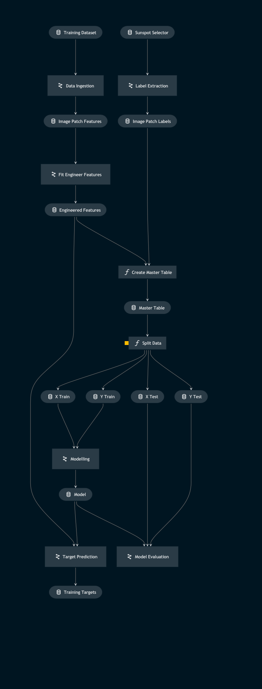

# Pipeline training_pipeline

> *Note:* This is a `README.md` boilerplate generated using `Kedro 0.18.3`.

## Overview

This pipeline:
1. Ingests a training dataset and the labels of its image patches
2. Creates a feature set, fits a standard scaler to specified features and transforms them
3. Creates a master table of model input data for reference
4. Splits the data in a specified ratio for training/testing
5. Trains a support vector machine with an RBF kernel
6. Evaluates the SVM's performance
7. Saves predicted targets to (optionally) verify correct pipeline operation with `SunspotSelector` widget in a Jupyter notebook
<!---
Please describe your modular pipeline here.
-->

## Pipeline inputs

<!---
The list of pipeline inputs.
-->

### `training_dataset`
|      |                    |
| ---- | ------------------ |
| Type | `dict[str, Callable[[] \| sunpy.map.Map]]` |
| Description | Kedro `PartitionedDataSet` - dictionary of callables for Map objects. Timeseries of `.fits` files aquired from the SunPy API. |

### `sunspot_selector`
|      |                    |
| ---- | ------------------ |
| Type | `sunspots.extras.utils.sunspot_selector.SunspotSelector` |
| Description | SunspotSelector class object used in a Jupyter notebook to interactively label patches containing sunspot/pore activity. The class stores the HMI and patch coordinates of these active regions. |

## Pipeline outputs

<!---
The list of pipeline outputs.
-->

### `training_targets`
|      |                    |
| ---- | ------------------ |
| Type | `np.ndarray` |
| Description | The model predictions for whether or not patches contain regions of solar activity, for all patches across all images of the dataset. |
 